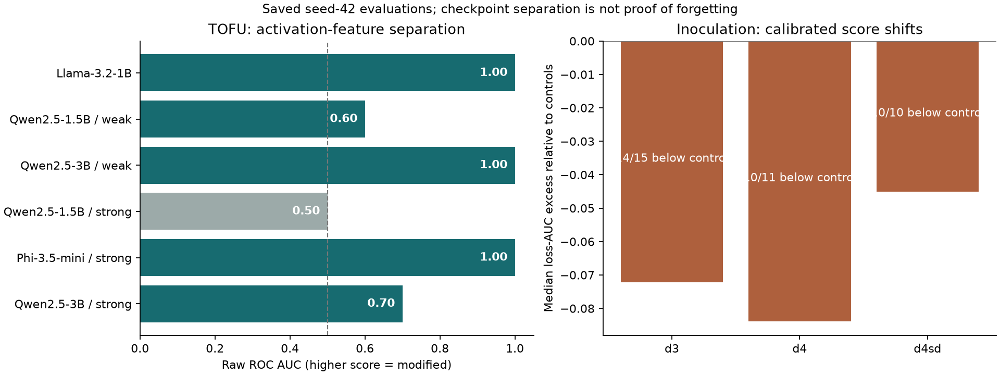

# Unlearning Fingerprints

Tools for inspecting the traces that fine-tuning, unlearning, and inoculation leave in open-weight language models. Compare activation geometry and token-level likelihood, inspect checkpoint identity, and reproduce the main comparisons from included measurements.

Feature extraction works on an individual model, without an original or shadow model. Evaluating checkpoint separation uses reference models; the inoculation calibration also explicitly uses references. This is a diagnostic toolkit, not a certificate of successful forgetting.

## Main Results

**Activation features distinguish checkpoint groups in several TOFU settings.** The cosine-anomaly feature perfectly ranks unlearning-method checkpoints above the two reference checkpoints in three of the six included configurations. The other configurations are retained too:

| TOFU configuration | Cosine-anomaly ROC AUC |
|---|---:|
| Llama-3.2-1B | **1.00** |
| Qwen2.5-1.5B, weak fine-tuning | 0.60 |
| Qwen2.5-3B, weak fine-tuning | **1.00** |
| Qwen2.5-1.5B, strong fine-tuning | 0.50 |
| Phi-3.5-mini, strong fine-tuning | **1.00** |
| Qwen2.5-3B, strong fine-tuning | 0.70 |

These are raw, direction-preserving AUCs from saved seed-42 measurements, with only two references per configuration. AUC measures checkpoint-label ranking, not whether answers have been forgotten.

**Inoculation produces measurable reference-calibrated shifts.** Across three setups, the loss-based calibrated statistic is below the reference baseline for **14/15**, **10/11**, and **10/10** modified-model entries. These exploratory comparisons include controls and stage-1 attachments as well as deployed models. The third setup uses references from the second, rather than matched controls of its own.

**Geometry and likelihood provide complementary diagnostics.** Strong activation separation does not always coincide with a selective change in prompt likelihood. Checking both helps distinguish a detectable model change from evidence about knowledge removal.



The numerical overview is in [results/summary.json](results/summary.json). See [the protocol](docs/protocol.md) for measurement definitions, provenance, and limitations.

## Reproduce The Overview

Requires Python 3.12 and [uv](https://docs.astral.sh/uv/). No GPU, checkpoint access, or model downloads are needed for the included-result analysis. Installing dependencies requires internet access on the first run.

Run from the repository root:

```bash
uv sync --locked
uv run --locked python summarize.py
uv run --locked python experiments/check_integrity.py --results_root experiments/results
uv run --locked python experiments/check_integrity.py --results_root mia_inoculation/results
```

The overview, calibrated comparisons, and input hashes are written to `runs/summary/`. The committed `results/` overview was generated with `python summarize.py --output_dir results`. Curated input measurements are not overwritten by this workflow.

## Evaluate A Model

Fresh inference needs accessible Hugging Face checkpoints and sufficient memory. A CUDA GPU is recommended; choose a compatible PyTorch build using the [PyTorch installation guide](https://pytorch.org/get-started/locally/). The lockfile is the analysis environment, not a promise of a particular CUDA build. If you replace PyTorch in the environment, use `uv run --no-sync` for inference so uv does not restore the locked build.

Some models require accepting their access terms. Inoculation checkpoints currently require authorized access. Authenticate with `uv run hf auth login` when needed; never put credentials in source files.

```bash
uv run --no-sync python experiments/spectral.py --registry llama --model original --seed 42 --output_dir runs/llama/spectral
uv run --no-sync python experiments/mia.py --registry llama --model original --seed 42 --output_dir runs/llama/mia
```

Repeat for the other registry tags (`retain`, `rmu`, `npo`, `graddiff`, `altpo`, `undial`, `idknll`) before a full-family comparison:

```bash
uv run --no-sync python experiments/detect.py --registry llama --spectral_dir runs/llama/spectral --spectral_only --output_dir runs/llama/detection
uv run --no-sync python experiments/mia_detect.py --registry llama --mia_dir runs/llama/mia --output_dir runs/llama/mia_detection
```

For an inoculation checkpoint, choose its registry and probe explicitly:

```bash
uv run --no-sync python experiments/mia.py --registry inoc_d3 --model d3_lora_IA_r1 --probe demo3 --seed 42 --output_dir runs/inoc_d3_pilot/mia
uv run --no-sync python mia_inoculation/mia_floor.py --registry inoc_d3 --only d3_lora_IA_r1 --probes mia_inoculation/probes/inoc_probes_floor_demo3.json --output_dir runs/inoc_d3_floors
```

Fresh token scoring corrects the historical padding-boundary mask and records its version. Recompute both signal and baseline measurements for **all required models and references** before calibrating a new run; do not mix fresh and historical token measurements. More commands and the registry map are in [docs/protocol.md](docs/protocol.md).

## Contents

- `experiments/`: checkpoint registries, model loading, activation/weight/likelihood tools, and frozen inoculation probes.
- `experiments/results/`: canonical TOFU spectral and likelihood measurements, plus inoculation spectral measurements.
- `mia_inoculation/`: matched-domain probe splits, baseline extraction, calibration, and canonical inoculation likelihood measurements.
- `summarize.py`: offline reproduction of the overview.
- `results/`: one overview figure, compact derived results, and input hashes.
- `runs/`: ignored output location for your own analyses and inference.

Optional `weights.py` and `samples.py` tools inspect weight statistics and generate qualitative completions. Weight-only statistics are not the main result; the older weight-output collection is intentionally not bundled. Training orchestration and model weights are outside this repository's scope.

## Data And Access

TOFU data comes from [locuslab/TOFU](https://huggingface.co/datasets/locuslab/TOFU); public TOFU checkpoint families come from [OpenUnlearning](https://huggingface.co/open-unlearning). Inoculation inputs and model identifiers originate from [LearntInoculation](https://github.com/Xenomirant/LearntInoculation). Model repositories are listed in `experiments/common.py`.

Upstream data and model terms still apply. Included measurements allow offline inspection even when a checkpoint is gated or private. No model weights, access tokens, or training logs are bundled.
